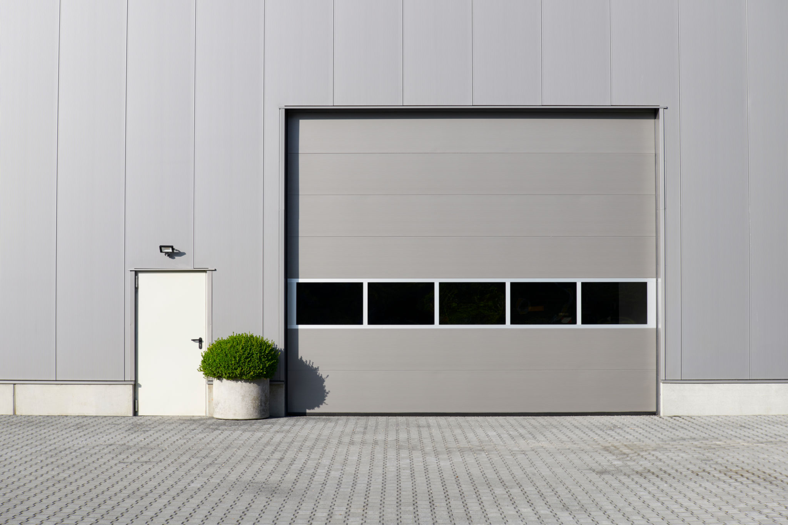

# Dorcraft - Professional Door & Gate Services



> A modern, highly-responsive landing page and company portfolio for **Dorcraft**, a business specializing in the installation and maintenance of doors and garage gates.

## ✨ Features

- **Premium UI/UX**: Designed with a sleek dark theme, glassmorphism effects, and smooth micro-animations.
- **Fully Responsive**: Adapts seamlessly to all screen sizes, from mobile devices to ultrawide desktop monitors.
- **Multi-page Architecture**: 
  - `index.html` - Engaging hero section, core services, and call-to-actions.
  - `about.html` - Company background, values, and quality guarantees.
  - `contact.html` - Contact information and an elegant, glass-styled inquiry form.
- **Zero Dependencies**: Built entirely with Vanilla HTML, CSS, and JS for maximum performance and instant load times.

## 🛠️ Tech Stack

- **HTML5**: Semantic markup for better accessibility and SEO.
- **CSS3 (Vanilla)**: Custom styling using CSS variables, Flexbox/Grid, and Backdrop-filter for glassmorphism.
- **JavaScript (ES6)**: Lightweight scripts for scroll detection and interactive UI elements.
- **Typography**: [Google Fonts](https://fonts.google.com/) (Inter & Outfit).
- **Icons**: [Phosphor Icons](https://phosphoricons.com/).

## 🚀 Getting Started

Since this is a static website, you don't need any complex build tools like Node.js or Webpack to run it.

### Prerequisites
Any simple HTTP server. For example, if you have Python installed, you can use its built-in server.

### Running Locally
1. Clone the repository:
   ```bash
   git clone https://github.com/awalicki/Dorcraft_webpage.git
   ```
2. Navigate to the project directory:
   ```bash
   cd Dorcraft_webpage
   ```
3. Start a local server:
   ```bash
   # Using Python 3
   python3 -m http.server 8000
   ```
4. Open your browser and visit `http://localhost:8000`.

## 📁 Project Structure

```text
Dorcraft_webpage/
├── css/
│   └── site.css          # Global styles, variables, and animations
├── img/                  # High-quality assets and background images
├── index.html            # Landing Page
├── about.html            # About Us Page
├── contact.html          # Contact & Form Page
└── .gitignore            # Git ignore rules
```

## 📄 License

&copy; 2026 Dorcraft. All rights reserved. 
